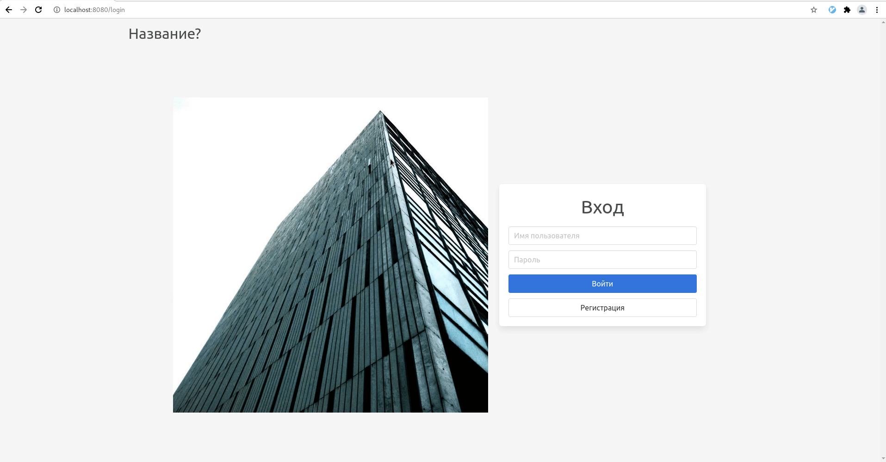

= Photosharing

*Photosharing* - небольшое приложение, в котором можно делиться фотографиями.

Большая часть кода этого проекта написана студентами.

== Демо

== Слайды

Слайды презентаций, который я показывал:

. https://cac03.github.io/hse-slides/photosharing.html#/[часть 1]
. https://cac03.github.io/hse-slides/photosharing-2.html#/[часть 2]

== Запуск

Самый простой способ запустить приложение:

[source,bash]
----
$ ./mvnw spring-boot:run
----

оно будет доступно на `8080` порту.

== Как открыть его в IDEA?

. Склонировать _репозиторий_
. File
. New
. Project from Existing Sources
. Выбрать `pom.xml`

== Что реализовано?

* Регистрация и вход
* Загрузка и отображение фотографий

== Что можно улучшить?

. Добавить уровень *сервисов* в приложение: сейчас всё делается напрямую в ``@Controller``'ах
. Перестать хранить пароли в открытом виде. Для этого нужно посмотреть на https://docs.spring.io/spring-security/site/docs/current/api/org/springframework/security/crypto/password/PasswordEncoder.html[`PasswordEncoder`]
. Добавить тесты (ну как всегда)

== Баги

. Сейчас можно "загрузить фотографию", _не выбрав никакой файл_

== Что используется в приложении?

Основные зависимости приложения:

. https://spring.io/projects/spring-boot[Spring Boot]. Думаю лучше всего, что это поясняет сама документация:
+
> Spring Boot makes it easy to create stand-alone, production-grade Spring based Applications that you can "just run".
+
. https://db.apache.org/derby/[Apache Derby] -- база данных, написанная на Java. В приложении -- она в embedded режиме.
. https://docs.spring.io/spring-framework/docs/current/reference/html/web.html[Spring MVC] -- модуль для создания веб-приложений.
. https://bulma.io/[Bulma] -- CSS фреймворк, используется в html шаблонах

== Как создать аналогичный проект?

Всё начинается со https://start.spring.io[start.spring.io]

== С чего начать погружаться в Spring?

. Лучший способ -- начать с https://spring.io/guides[Guides] - небольших статей, описывающих как создавать несложные Spring приложения.
. Для исчерпывающего понимания -- https://docs.spring.io/spring-framework/docs/current/reference/html/[reference документация]
. Можно почитать https://www.oreilly.com/library/view/spring-in-action/9781617294945/[Spring in Action]
. Google + Spring Boot
